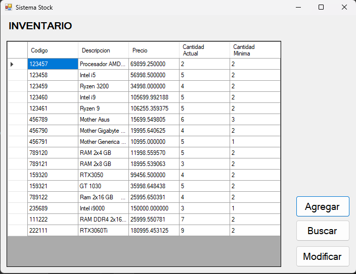
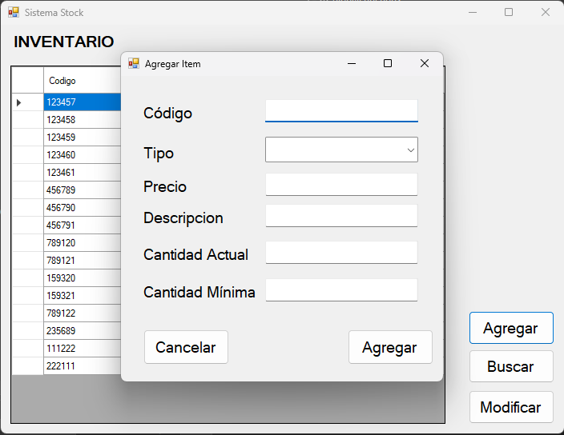
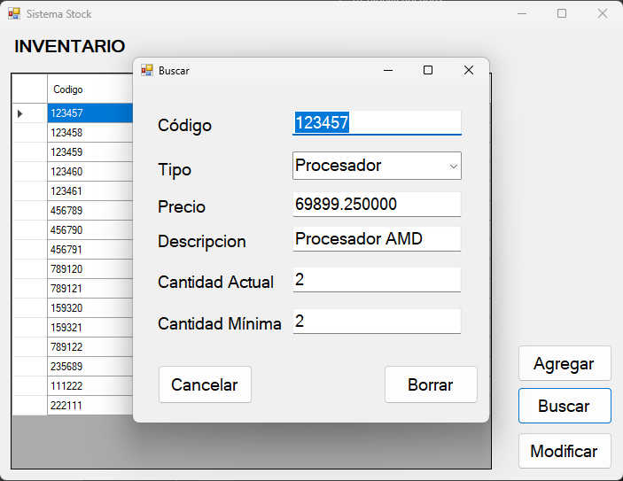
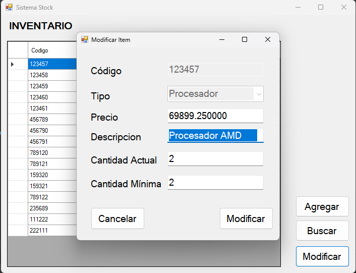

# Gestion de Inventario para venta de Hardware
Realizado en C++/CLR, el sistema usa archivos binarios locales como base de datos.
## Conceptos aplicados
* Programación orientada a eventos
* Estructura de datos, structs, para los registros de artículos
* Flujo de archivos de C, con fstream.
* CRUD
## Capturas de pantalla

Pantalla principal

Agregar un item

Buscar/Borrar Item

Modificar Item

